# Durum-Web — Technical Documentation

**Version:** Model 2.1 · Application `durum-web`  
**Normative reference:** [`Ilerleme-Durum-Modeli.md`](../Ilerleme-Durum-Modeli.md)  
**Audit & Test Report:** [`SYSTEM-AUDIT-AND-TEST-REPORT.md`](./SYSTEM-AUDIT-AND-TEST-REPORT.md)  
**Last updated:** 2026-08-30  
**Single source of truth (code):** `src/model/constants.ts` → `MODEL` block

This document explains how the **durum-web** progress panel works, which formulas it uses, and where data lives. If the Canvas (`ilerleme-durum-dashboard.canvas.tsx`) diverges from the code, **the code wins**; this document must be kept in sync with the code.

---

## Table of Contents

1. [System overview and philosophy](#1-system-overview-and-philosophy)
2. [Architecture](#2-architecture)
3. [Data model](#3-data-model)
4. [Formulas](#4-formulas)
5. [Page-by-page guide](#5-page-by-page-guide)
6. [Oak curriculum](#6-oak-curriculum)
7. [Today page flow](#7-today-page-flow)
8. [Map (graph layout)](#8-map-graph-layout)
9. [FSRS review queue](#9-fsrs-review-queue)
10. [localStorage schema and migration](#10-localstorage-schema-and-migration)
11. [Seed data (EDR-stage profile)](#11-seed-data-edr-stage-profile)
12. [Known limitations and future work](#12-known-limitations-and-future-work)

---

## 1. System overview and philosophy

### 1.1 What it is not

Durum-web is **not a calendar app**. It does not issue date-based orders like "DNS on August 27." Time is an **input** (how many hours you studied); the real output is **competency state**.

### 1.2 What it does

| Dimension | Meaning | Code key |
|-----------|---------|----------|
| **D1 Technical (T)** | Weighted average of 12 skill domains | `computeAll` → `T` |
| **D2 Production (P)** | Lab / project / proof artifacts | `computeAll` → `P` |
| **D3 Language (L)** | DE + EN composite score | `computeAll` → `L` |
| **D4 Career (C)** | CV, network, funnel, interview prep | `computeAll` → `C` |
| **R (Readiness)** | Germany junior application readiness (0–100) | `computeRFromDims` |
| **Gates** | Condition-based career stages (0, A–F) | `evaluateGates` |
| **Velocity** | CTL/ATL/TSB + predicted/measured velocity | `buildPmc`, `predictedVelocity` |
| **Review** | FSRS-based forgetting queue | `retrieval[]`, `isRetrievalDue` |
| **Daily plan** | 14-day rolling schedule + A/B day rhythm + dual channel | `useRollingSchedule` |

### 1.3 Core principles

1. **Evidence ladder:** No score can exceed what evidence allows (`evidenceCap`).
2. **Asymmetric latch:** Raising score/evidence **requires** a reference; **lowering** is free (`tryRaiseSkill` in `store.tsx`).
3. **Decay:** Domains without practice decline over time (`decayMultiplier`).
4. **Gate conjunction:** AND logic; the weakest link is the bottleneck (`π_G`, `bottleneck`).
5. **Append-only log:** Historical measurement points live in `history[]`; calibration via snapshot.
6. **Cognitive balance (A/B rhythm):** Instead of cramming everything into every day, topic-focused (A) and lab-focused (B) days balance cognitive load (`getDayType`).
7. **Safety valve (anti-snowballing):** Carried tasks are capped (`MAX_CARRY = 2`) and age out (`MAX_CARRY_AGE_DAYS = 7`); sustainability is preserved instead of a debt feeling.

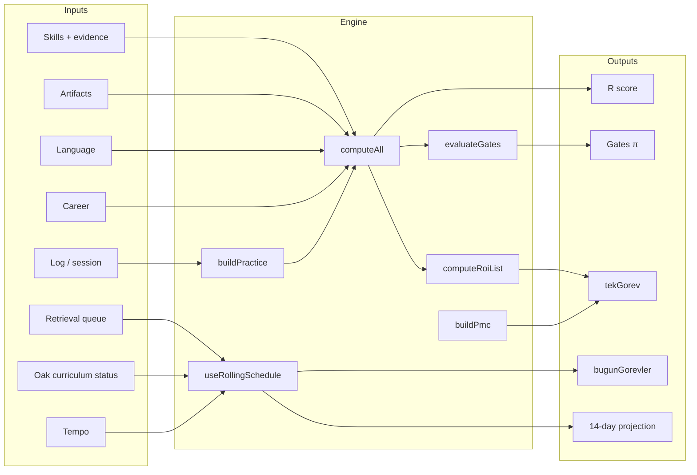

---

## 2. Architecture

### 2.1 Technology stack

| Layer | Technology | File |
|-------|------------|------|
| UI | React 19 + TypeScript | `src/pages/*.tsx` |
| Routing | react-router-dom | `src/App.tsx` |
| State | React Context + `useState` | `src/store.tsx` |
| Derived data | `useMemo` hook | `src/useDerived.ts` |
| Plan engine | `useMemo` hook | `src/useRollingSchedule.ts` |
| Curriculum status | Separate localStorage hook | `src/useCurriculumStatuses.ts` |
| Model | Pure functions | `src/model/compute.ts` |
| Constants | Single `MODEL` object | `src/model/constants.ts` |
| Persistence | `localStorage` JSON | `STORAGE_KEY`, `CURRICULUM_STORAGE_KEY` |

### 2.2 Layer diagram

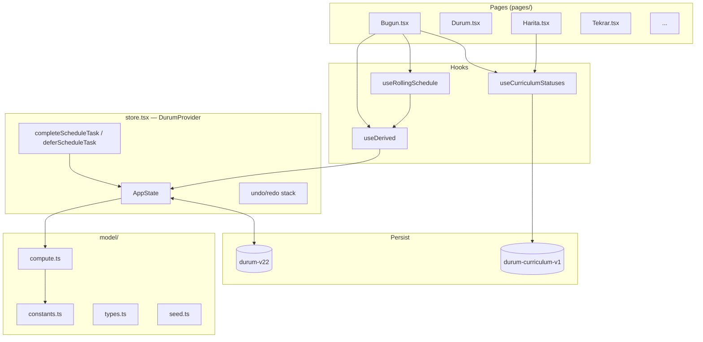

### 2.3 Data flow: user action → UI

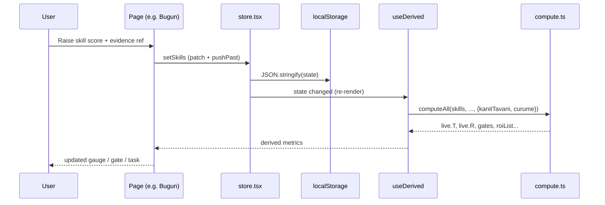

### 2.4 Undo / redo

- **Stack:** `pastRef` / `futureRef`, max 50 steps (`MAX_HISTORY`).
- **Coalescing:** Consecutive edits within 800 ms count as one step (`COALESCE_MS`).
- **Shortcut:** `Ctrl+Z` / `Ctrl+Y` (works inside inputs too).
- **Persistence:** After undo, `localStorage` is updated via microtask.

### 2.5 localStorage keys (summary)

| Key | Content | File |
|-----|---------|------|
| `durum-v22` | Full `AppState` | `constants.ts` → `STORAGE_KEY` |
| `durum-curriculum-v1` | Oak topic statuses | `oakCurriculum.ts` → `CURRICULUM_STORAGE_KEY` |

---

## 3. Data model

### 3.1 AppState (`types.ts`)

```typescript
type AppState = {
  skills: Skill[];           // 12 domains
  artifacts: Artifact[];   // production evidence
  lang: LangState;         // DE + EN
  career: CareerItem[];    // 5 career items
  tempo: Tempo;            // weekly hours + quality
  retrieval: RetrievalItem[];  // FSRS queue
  history: LogRecord[];    // append-only log
  pending: string[];       // JSONL lines awaiting export
  chancenkarte: ChancenkarteState;
  draft: SessionDraft;     // Log page draft
  scheduleCarry: ScheduleCarryItem[];      // carried tasks
  scheduleCompletedToday: Record<string, string[]>;  // ISO date → completed ids
};
```

### 3.2 Skill

| Field | Type | Description |
|-------|------|-------------|
| `id` | string | `net`, `linux`, `win`, … `port` |
| `name` | string | Display name |
| `weight` | number | T weight (Σw = 10.9 excluding port) |
| `claimed` | 0–10 | Claimed score |
| `evidence` | `yok` \| `kayit` \| `public` | Evidence level |
| `ref` | string | File path or URL |

### 3.3 RetrievalItem (FSRS)

| Field | Type | Description |
|-------|------|-------------|
| `topic` | string | Topic text |
| `alan` | string | Skill domain id |
| `difficulty` | kolay \| orta \| zor | Difficulty |
| `n` | number | Successful review count (for decay τ) |
| `stability` | number | S — stability (days) |
| `ef` | number | Easiness factor (SM-2 derivative) |
| `lastIso` | string | Last review time |

### 3.4 scheduleCarry and scheduleCompletedToday

**scheduleCarry:** When capacity is insufficient or the user taps "Defer to tomorrow," the task is written here. The next day `packDay` processes it **first** by priority.
- **Cap (`MAX_CARRY = 2`):** Carried tasks are limited to 2 to guard against carry snowball risk.
- **Aging (`MAX_CARRY_AGE_DAYS = 7`):** Tasks carried for more than 7 days are automatically cleared and returned to the curriculum pool so they do not create psychological debt.
- **Store functions:** `deferScheduleTask`, `clearScheduleCarry`, and `recycleScheduleCarry` ("Return to Pool" button).

**scheduleCompletedToday:** ISO date (`YYYY-MM-DD`) → task `id[]`. Tasks completed or deferred today are hidden from the list; simulation does not re-add them.

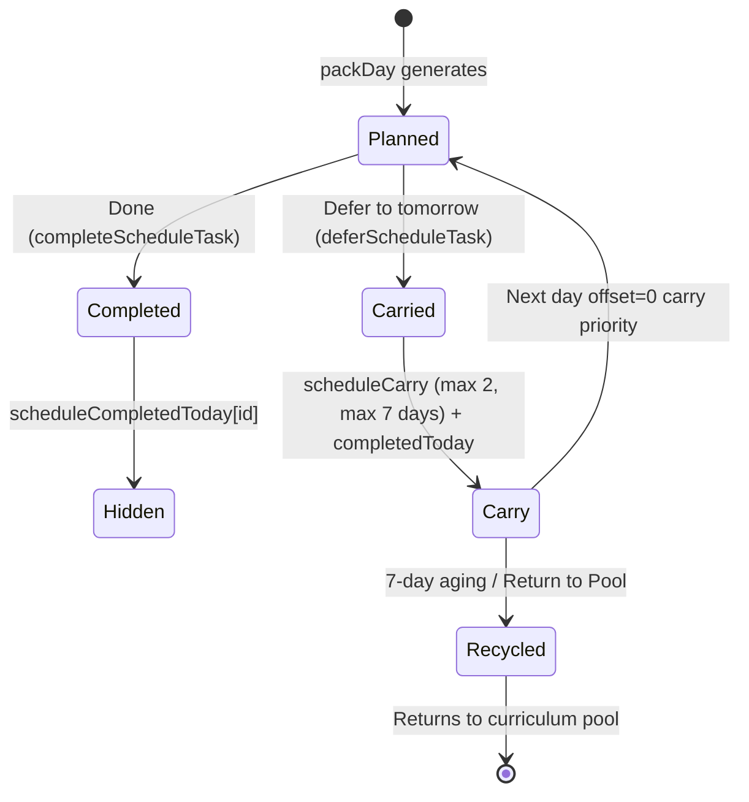

### 3.5 CurriculumStatus (Oak)

| Status | Meaning |
|--------|---------|
| `ogrenilmedi` | Not started yet |
| `ogreniyorum` | Active (default for covered topics) |
| `kuyrukta` | In FSRS queue (matches `retrieval`) |
| `pekiştirildi` | Counted as completed |
| `sonra` | Post-EDR — locked (`upcoming: true`) |

Resolution: `resolveStatus()` in `useCurriculumStatuses.ts`.

---

## 4. Formulas

All constants come from the `MODEL` object (`src/model/constants.ts`). The formulas below match the **code exactly**.

### 4.1 Evidence ceiling

```
oran(yok)   = 0.50  →  ceiling = 5.0
oran(kayit) = 0.80  →  ceiling = 8.0
oran(public)= 1.00  →  ceiling = 10.0

x_tavanli = min(x_beyan, oran(kanıt) × x_max)
```

**Code:** `evidenceCap(tier, max)` → `compute.ts`

### 4.2 Decay and S_etkin

```
τ(n) = τ₀ × bⁿ     τ₀ = 10,  b = 2
çarpan(Δt, n) = taban + (1 − taban) × exp(−Δt / τ(n))     taban = 0.5

S_etkin = S_tavanli × çarpan(Δt, n)
```

- `Δt`: Days since last `session` or `retrieval` (`buildPractice`).
- `n`: Successful retrieval count; `basarisiz` → n − 2.

**Code:** `decayMultiplier`, `buildPractice`, `computeAll`

### 4.3 T — Technical composite

```
T = Σ (wᵢ × S_etkin,ᵢ) / Σ wᵢ        port EXCLUDED (tHaric: ["port"])
Σw(T) = 10.9
```

#### Skill weights (canonical)

| id | Domain | w | S* (target) |
|----|--------|---:|---:|
| `def` | Defensive/SOC | 1.5 | 7 |
| `win` | Windows/AD | 1.4 | 6 |
| `port` | Portfolio | 1.4 | 7 (P/ROI only) |
| `linux` | Linux | 1.3 | 6 |
| `net` | Networking | 1.2 | 6 |
| `siem` | SIEM | 1.1 | 7 |
| `secfund` | Security Fundamentals | 1.0 | 6 |
| `netsec` | Network Security | 0.9 | 5 |
| `py` | Python | 0.8 | 4 |
| `off` | Offensive | 0.7 | 3 |
| `crypto` | Crypto | 0.6 | 4 |
| `cloud` | Cloud | 0.4 | 3 |

**Code:** `computeAll` loop; `MODEL.tHaric`, `MODEL.hedef.S`

### 4.4 P — Production score

```
q_etkin = min(sahiplik, oran(kanıt))
katkı = q_etkin × v(tür)

P_sat(sum) = 10 × (1 − exp(−sum / κ))     κ = 5

P = max over tier t ∈ {public, kayit, yok}:
      min( P_sat(Σ_{kanıt ≥ t} katkı), oran(t) × 10 )
```

#### Artifact values (v)

| Type | v | Typical hours |
|------|---:|---:|
| `soc-lab` | 3.0 | ~60 |
| `ad-lab` | 2.5 | ~40 |
| `vm-lab` | 2.0 | ~25 |
| `arac` | 1.5 | ~15 |
| `writeup` | 0.5 | ~6 |
| `lab-egzersizi` | 0.5 | ~8 |

**Code:** `MODEL.artefaktDeger`, `MODEL.pKappa`, `computeAll` P branch

### 4.5 L — Language score

```
DE = 0.6 × konuşma + 0.4 × genel
EN = 0.6 × konuşma + 0.4 × genel
L  = 0.55 × DE_etkin + 0.45 × EN_etkin
```

CEFR anchors: A1=1.5, A2=3, B1=5, B2=7.5, C1=9.5

**Code:** `langComposite`, `langScores`, `MODEL.L`

### 4.6 C — Career score

```
C = Σ min(beyanᵢ, oran(kanıtᵢ) × maxᵢ)     Σ max = 10
```

| Item | max |
|------|---:|
| CV ready | 2 |
| Network (LinkedIn + reference) | 2 |
| Internship documented | 2 |
| Application funnel active | 2 |
| Interview practice | 2 |

### 4.7 R — Readiness (geometric, ρ=0)

```
T̂ = max(T/10, 0.02)
P̂ = max(P/10, 0.02)
L̂ = max(L/10, 0.02)
Ĉ = max(C/10, 0.02)

R = 100 × T̂^0.40 × P̂^0.25 × L̂^0.20 × Ĉ^0.15
```

**Target vector:** T*=5.8, P*=6.6, L*=7.5, C*=9.0 → **R_hedef ≈ 67.3**  
**Entry vector:** T*=5.0, P*=5.0, L*=6.1, C*=7.0 → **R_giriş ≈ 54.8**

Three R layers (`useDerived`):

| Indicator | Computation | Meaning |
|-----------|-------------|---------|
| `beyan.R` | kanitTavani=false, curume=false | Pure claim |
| `kanitsizTavan.R` | kanitTavani=true, curume=false | Evidence ceiling |
| `live.R` | kanitTavani=true, curume=true | **Effective (gates use this)** |

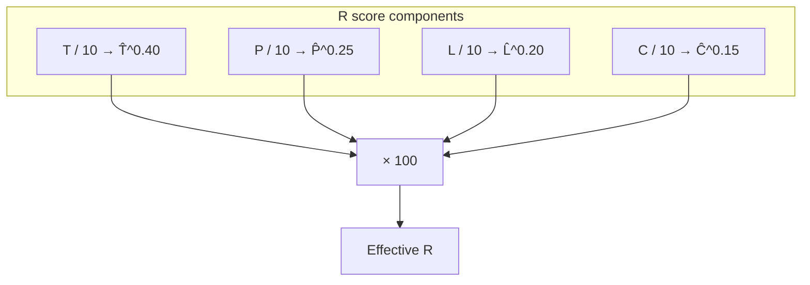

**Code:** `computeRFromDims`, `rHedef`, `rGiris`

### 4.8 CTL / ATL / TSB

```
load_g = (h_siber × 0.80 + h_dil × 0.20) × kalite × 10

CTL_g = CTL_{g−1} + (load_g − CTL_{g−1}) / 42
ATL_g = ATL_{g−1} + (load_g − ATL_{g−1}) / 7
TSB   = CTL − ATL

v_tahmin(CTL) = (0.7 × CTL − 3.7) / 9.25
v_tahmin(plan) = (h_eff − 3.7) / 9.25     h_eff = (h_s×0.8 + h_d×0.2) × kalite
```

- `h₀ = 3.7`: maintenance threshold; below it v is negative.
- `kalite`: last 14-day session average or `tempo.quality`.

**Code:** `buildPmc`, `predictedVelocity`, `predictedVelocityFromCtl`

### 4.9 FSRS — retrievability

```
R(t, S) = (1 + factor × t / S)^(−w20)

factor = 0.6935    (code constant; ≈ ln 2)
w20    = 0.2
rHedef = 0.85

due ⇔ R(t, S) < 0.85
```

**Stability update (SM-2 derivative):**

| Outcome | EF | S | n |
|---------|----|---|---|
| `basarili` | min(ef+0.1, 2.8) | min(s×ef, 90) | n+1 |
| `zorlandim` | max(ef−0.14, 1.3) | s × max(1, ef−0.6) | — |
| `basarisiz` | max(ef−0.54, 1.3) | max(s×0.35, s₀) | max(n−2, 0) |

Initial: `s₀=3`, `ef₀=2.5`

**Code:** `retrievability`, `isRetrievalDue`, `nextStability`

### 4.10 Chancenkarte points engine

Prerequisite: vocational training ≥2 years ∧ (DE≥A1 ∨ EN≥B2) ∧ proof of subsistence.

| Criterion | Points |
|-----------|---:|
| Partial recognition (Anerkennung) | 4 |
| German B2+ | 3 |
| German B1 | 2 |
| German A2 | 1 |
| English C1 | 1 |
| Age ≤35 | 2 |
| Age ≤40 | 1 |
| Shortage occupation (claimed) | 1 |

**Threshold:** net ≥ 6 points (`MODEL.chancenkarte.puanEsik`)

**Runway (Gate F):**

```
runway_ay = (birikim + aylikTasarruf × 12) / 1091
```

**Code:** `computeChancenkarte`, `runwayAy`

### 4.11 ROI and tekGorev

```
ROI = ΔR / saat
ROI_etkin = ROI × (1 + λ × [is job gate bottleneck?])     λ = 1.5
```

`ΔR` is computed by re-running `computeAll` for each candidate (not an analytic derivative).

**tekGorev priority order** (`useDerived`):

1. Return mode → light review
2. TSB < −20 → rest
3. Overdue review ≥1
4. Daily budget from ROI list (≤0.75 h)
5. Fallback: update scores

**Code:** `computeRoiList`, `useDerived` → `tekGorev`

### 4.12 Bottleneck domain (claimed/weight)

For rolling schedule and Map "Today" filter:

```
bottleneckAlan = argmin_{s ≠ port} (claimed_s / weight_s)
```

**Seed example:**

| Domain | claimed | w | claimed/w |
|--------|--------:|---:|---:|
| def | 3 | 1.5 | **2.00** ← lowest |
| win | 3 | 1.4 | 2.14 |
| siem | 3 | 1.1 | 2.73 |
| linux | 4 | 1.3 | 3.08 |
| net | 6 | 1.2 | 5.00 |

→ Weak domain: **Defensive/SOC** (`def`)

**Dimension bottleneck** (T/P/L/C):

```
darbogaz = argmin_k (v_k / hedef_k)
```

Seed: P=0.95/6.6 = **0.144** (Production is the weakest dimension)

**Code:** `bottleneckAlan` in `useRollingSchedule.ts`; `useDerived` → `darbogaz`

### 4.13 Rolling schedule — capacity, packDay, and A/B day rhythm

**Daily capacity:**

```
dailyCyber = max(0.5, hoursCyber / 7)
kapasite   = clamp(dailyCyber, 0.75, 2.0)   hours

Return mode or TSB < −20 (today): kapasite = 0.25 h
```

**28 h/week example:** `28/7 = 4` → `min(2, max(0.75, 4))` = **2 h/day**

**A/B day (Topic Day vs Lab Day) rhythm:**
Instead of squeezing 4 different blocks (Review + Foundation + Weak Domain + Lab) into 120 minutes and creating cognitive fragmentation (107.5% fill), a 2:1 rhythm via `getDayType(offset)` is used:

- **Day A (Topic Day — Deepening):**
  - FSRS Review (max 3) → ~24 min
  - Foundation Spine Topic (`FOUNDATION_ALANS`) → ~30 min
  - Weak Domain Topic (`bottleneckAlan`) → ~30 min
  - *Total:* ~84–85 min (focused theoretical deepening)
- **Day B (Lab Day — Application):**
  - FSRS Review (max 2) → ~16 min
  - Comprehensive SOC / AD Lab Practice → ~60–90 min
  - *Total:* ~76–106 min (uninterrupted practice focus)

**Rhythm cycle:** If `offset % 3 === 2` then **Day B (Lab Day)**, otherwise **Day A (Topic Day)**.

**packDay priority flow:**

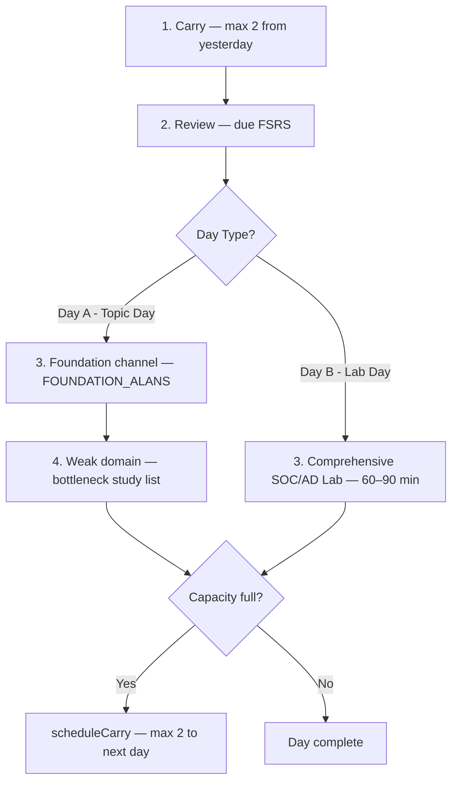

**Dual channel (foundation + weak):**

| Channel | Domains | Ordering | Purpose |
|---------|---------|----------|---------|
| **Foundation** | `net`, `linux`, `secfund` | ascending `claimed/weight` + round-robin | SOC path spine |
| **Weak** | `bottleneckAlan` | Oak curriculum order, `studyCandidates` | Close bottleneck |

**Task durations and limits:**

| Type | Duration | Day limit |
|------|----------|-----------|
| tekrar | 8 min (0.133 h) | max 3 on Day A, max 2 on Day B |
| konu / temel | 0.5 h | 1 foundation + 1 weak domain on Day A |
| lab | 1.0–1.5 h (ROI/SOC) | 1 comprehensive lab on Day B |
| carry | per task duration | max 2 tasks, 7-day lifetime |

**Code:** `packDay`, `useRollingSchedule`, `getDayType`, `FOUNDATION_ALANS`

### 4.14 Gate pipeline

```
π_G = ort( min(1, xᵢ / eşikᵢ) )
darboğaz = argminᵢ (xᵢ / eşikᵢ)
```

| Gate | Condition | Unlocks |
|------|-----------|---------|
| **0** | Recognition status known | Chancenkarte / visa path |
| **A** | net≥6 ∧ linux≥6 ∧ win≥5 | Defensive lab intensity |
| **B** | A ∧ secfund≥6 ∧ siem≥5 | Mini SOC lab |
| **C** | ≥2 public+owned artifacts, ≥1 deger≥2.5 | CV project line |
| **D** | R≥R_giriş ∧ C ∧ 0 ∧ DE≥5 ∧ EN≥7 | Germany application |
| **E** | D ∧ ≥2 interviews in last 14 days | Intensive interviews |
| **F** | Runway ≥12 months | Chancenkarte duration |

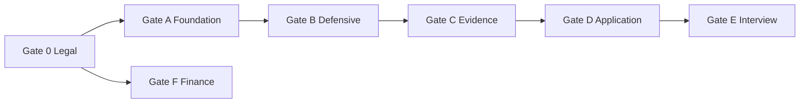

All thresholds are compared against **`S_etkin`** (evidence + decay).

**Code:** `evaluateGates`, `GatePipeline.tsx`

### 4.15 Numerical examples

#### Example A — Seed R calculation

```
T = 44.7 / 12.3 = 3.63
P = 0.95
L = 0.55×2 + 0.45×5 = 3.35   (EN capped)
C = 2.00

R = 100 × 0.363^0.40 × 0.095^0.25 × 0.335^0.20 × 0.200^0.15
  ≈ 26.62
```

#### Example B — FSRS due date (seed r1, S=3)

```
R(11, 3) = (1 + 0.6935 × 11/3)^(−0.2) ≈ 0.851
R(12, 3) = (1 + 0.6935 × 12/3)^(−0.2) ≈ 0.847 < 0.85  → DUE
```

#### Example C — v_tahmin (28 cyber + 7 lang, quality 0.85)

```
h_eff = (28×0.8 + 7×0.2) × 0.85 = 20.23
v = (20.23 − 3.7) / 9.25 ≈ 1.84 ΔR/week
```

---

## 5. Page-by-page guide

| Route | File | Function |
|-------|------|----------|
| `/` | `Bugun.tsx` | Daily task cards, 14-day timeline, journey strip, gauges |
| `/durum` | `Durum.tsx` | R ring, T/P/L/C, radar, evidence gap / decay |
| `/beceriler` | `Beceriler.tsx` | Skill/artifact/language/career editing + latch |
| `/kapilar` | `Kapilar.tsx` | Gate 0–F detail, π, bottleneck |
| `/almanya` | `Almanya.tsx` | Chancenkarte, Anerkennung, dual route ETA, runway |
| `/hiz` | `Hiz.tsx` | CTL/ATL/TSB chart, v, κ, ROI table, projection |
| `/harita` | `Harita.tsx` | Oak curriculum graph/tree/list, add to queue |
| `/tekrar` | `Tekrar.tsx` | FSRS queue, mark outcome, bulk add |
| `/log` | `Log.tsx` | Session, snapshot, JSONL import/export, seed reset |
| `/formuller` | `Formuller.tsx` | Formula reference generated from MODEL constants |

---

## 6. Oak curriculum

### 6.1 Source files

| File | Topic count | Meaning |
|------|------------:|---------|
| `src/data/tekrar-ekle.txt` | **141** | Active Oak path (up to EDR stage) |
| `src/data/tekrar-sonra.txt` | **8** | Post-EDR — SIEM/Splunk, SOC IR, Wazuh/Splunk Mini SOC Project (`upcoming: true`, locked/unlockable) |

Source: `Oak-Study-Notes/TEKRAR-EKLE.txt`, `TEKRAR-SONRA.txt`

### 6.2 Post-EDR locked topics and concrete SOC labs

Topics in `tekrar-sonra.txt` are detailed to industry standards for direct unlock after the EDR stage:

1. `SIEM Mimarisi ve Log Toplama (Syslog / WinEvent / Sysmon)`
2. `Splunk Temelleri ve SPL Sorgulama`
3. `SOC Alarm Triage ve Olay İnceleme (IR Workflow)`
4. `Nessus & Zaafiyet Taraması Temelleri`
5. `Project 2: Active Directory & Network Hardening`
6. `Project 3: Web & Network Sızma Testi Raporu`
7. `Project 4: Mini SOC & SIEM Lab (Wazuh / Splunk + Sysmon)`
8. `Temel GRC: ISO 27001, BSI IT-Grundschutz ve GDPR`

**Gate B & Gate C lab actions (`compute.ts`):**
- *Sysmon + Wazuh / Splunk Lab Setup and Analysis* ($v=3.0$, opens Gate B and C)
- *Active Directory Attack & Defense Lab* ($v=2.5$, for Gate C)

### 6.3 Parse format

```
alan|zorluk|konu metni
```

Example: `net|orta|DNS query/response (Wireshark)`

**Code:** `parseLines()` → `oakCurriculum.ts`

### 6.4 Edge generation (graph links)

1. **PAIR_RULES:** Keyword pairs (dns↔dhcp, kerberos↔ldap, …)
2. **Within-domain token sharing:** Shared token ≥4 chars in same domain → edge (max 2 per node)

**Code:** `attachLinks()`, `curriculumEdges()`

### 6.5 Foundation channel domains

```typescript
FOUNDATION_ALANS = ["net", "linux", "secfund"]
```

Builds baseline in the daily plan **independent** of the weak domain.

### 6.6 tekrar-ekle vs tekrar-sonra

| Feature | tekrar-ekle (covered) | tekrar-sonra (upcoming) |
|---------|------------------------|-------------------------|
| Auto-enters FSRS | No — selected from Map | No |
| Default status | `ogreniyorum` | `sonra` (locked) |
| Override | — | `allowSonraOverride` + `forceSonra` |
| In schedule | `studyCandidates` | Excluded (`pekiştirildi`/`ogrenilmedi`/`sonra`) |

---

## 7. Today page flow

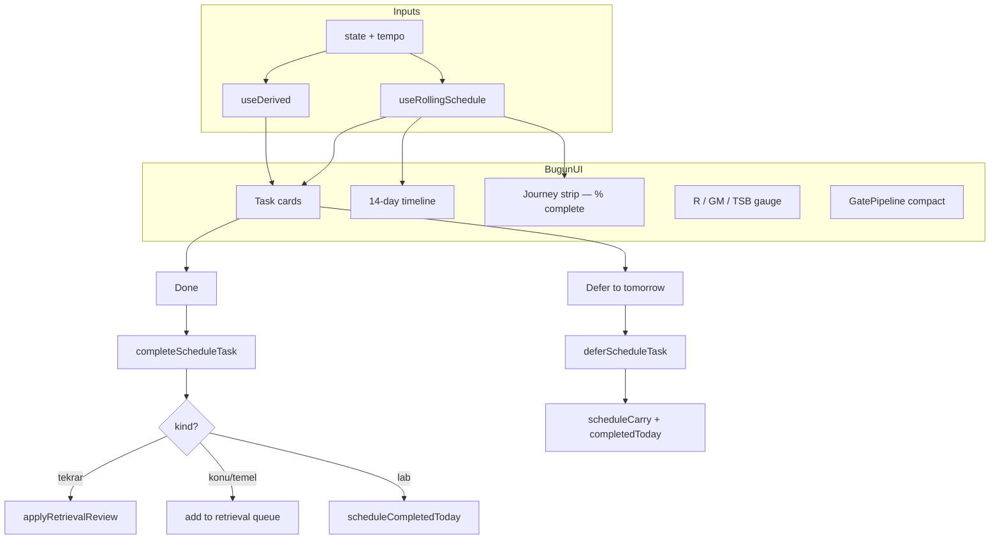

### 7.1 Task card types and UI components

| Component / kind | Label / description | Color / badge |
|------------------|----------------------|---------------|
| `dayType` badge | Day mode: `KONU GÜNÜ (Konu & Tekrar)` or `LAB GÜNÜ (Lab & SOC)` | `.bugun-day-badge--A` / `--B` |
| `scheduleCarry` indicator | `N carried tasks (cap: 2)` + `[Return to Pool]` button | `.bugun-gorevler__clear-carry` |
| `tekrar` | Topic review (due FSRS items) | Domain color |
| `temel` | Foundation topic study (`FOUNDATION_ALANS`) | `TEMEL` badge (.gorev-card__badge--temel) |
| `konu` | Next topic in weak domain (Bottleneck) | `ZAYIF ALAN` badge (.gorev-card__badge--zayif) |
| `lab` | Comprehensive Lab / SOC Practice (Day B) | `LAB / PRATİK` badge |
| `dinlenme` | Rest / light day | When TSB is low |

### 7.2 scheduleCompletedToday and carry behavior

- **Done:** Task id is added to today's list; hidden from UI. Related side effect runs (FSRS record updated or topic added to queue).
- **Defer to tomorrow:** Same id is added to today's list (hidden today) **and** to `scheduleCarry` (cap: 2).
- **Return to Pool (`recycleScheduleCarry`):** Deletes carried tasks in one click and returns them to the curriculum pool.
- **7-day aging:** Carried tasks older than 7 days are automatically dropped from memory.

### 7.3 14-day projection

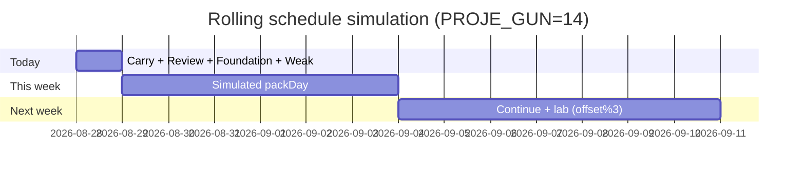

Simulation state (`SimState`) is updated each day; carried tasks are reflected in the `tasima` counter.

---

## 8. Map (graph layout)

### 8.1 View modes

| Mode | Description |
|------|-------------|
| `harita` | Force-directed graph (default) |
| `agac` | Domain-based tree |
| `liste` | Filterable table |

### 8.2 Layout pipeline

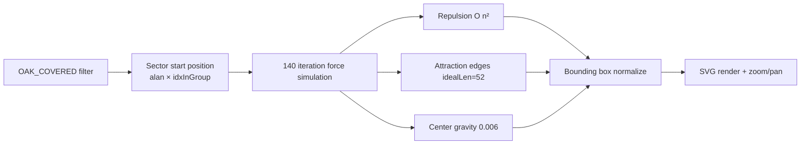

**Constants:** `repulsion=920`, `attraction=0.012`, `idealLen=52`, `damp=0.82`, `iterations=140`

**Code:** `forceDirectedLayout()` — `Harita.tsx` ~line 601

### 8.3 Zoom and labels

| Parameter | Value |
|-----------|-------|
| MIN_ZOOM | 0.35 |
| MAX_ZOOM | 3.5 |
| ZOOM_STEP | 1.15 |
| LABEL_ZOOM_THRESHOLD (141 nodes) | 1.5 |
| LABEL_ZOOM_THRESHOLD_SMALL (≤16 nodes) | 1.2 |

Label visibility: selected or hover → always; otherwise zoom threshold.

**Code:** `nodeLabelVisible`, `truncateNodeLabel`, `CurriculumGraph` component

### 8.4 Interaction

- Node click → detail panel, change status, add/remove from queue
- "Today" filter → bottleneck + `ogreniyorum` topics
- Upcoming topics → locked; override with `forceSonra`

---

## 9. FSRS review queue

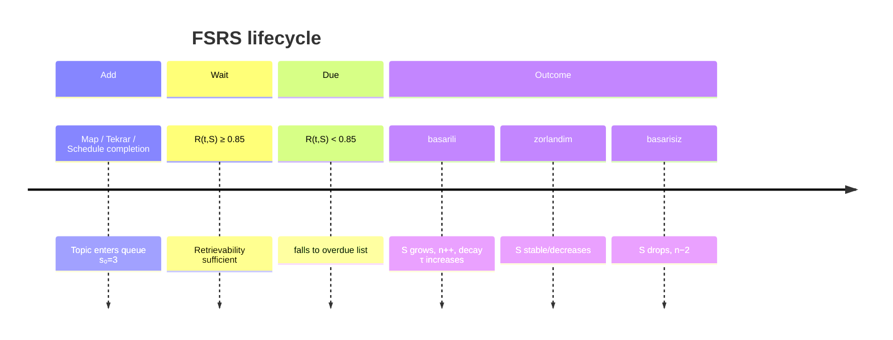

### 9.1 Queue priority

```
overdueRatio = (rHedef − R(t,S)) / rHedef     (when R < rHedef)
Sort: overdueRatio descending
Today limit: MODEL.tekrar.kuyrukTavani = 3
```

**Code:** `useDerived` → `overdue`, `kuyruk`; `Tekrar.tsx`

### 9.2 Schedule integration

`completeScheduleTask`:
- `tekrar-batch-*` → marks all overdue items `basarili`
- Single `tekrar-*` → corresponding `retrievalId`
- `konu` / `temel` → adds new `RetrievalItem` to `retrieval` if topic not present

---

## 10. localStorage schema and migration

### 10.1 durum-v22 (AppState)

```json
{
  "skills": [ /* 12 Skill */ ],
  "artifacts": [ /* Artifact[] */ ],
  "lang": { "deKonusma": 1, "deGenel": 1.5, "enKonusma": 4, ... },
  "career": [ /* 5 CareerItem */ ],
  "tempo": { "hoursCyber": 28, "hoursLang": 7, "hoursLangAlt": 14, "quality": 0.85 },
  "retrieval": [ /* RetrievalItem[] */ ],
  "history": [ /* LogRecord[] */ ],
  "pending": [],
  "chancenkarte": { "yas": 30, "gate0": "bilinmiyor", ... },
  "draft": { "alan": "net", "dakika": "60", ... },
  "scheduleCarry": [],
  "scheduleCompletedToday": { "2026-08-28": ["konu-oak-net-001-dns-..."] }
}
```

**Loading:** `loadState()` — missing fields merged with seed:

```typescript
{ ...createSeedState(), ...parsed, scheduleCarry: parsed.scheduleCarry ?? [], scheduleCompletedToday: parsed.scheduleCompletedToday ?? {} }
```

### 10.2 durum-curriculum-v1

```json
{
  "statuses": {
    "oak-net-001-dns-query-response-wireshark": "pekiştirildi",
    "oak-linux-012-chmod-sticky-bit": "ogreniyorum"
  }
}
```

### 10.3 Migration notes

| Version | Key | Change |
|---------|-----|--------|
| v22 | `durum-v22` | Added `scheduleCarry`, `scheduleCompletedToday` |
| v1 | `durum-curriculum-v1` | Oak statuses separated from main state |

Old keys are **not** auto-migrated; manual import or seed reset is required.

---

## 11. Seed data (EDR-stage profile)

**Date:** `2026-08-27T12:00:00+03:00` (`SEED_ISO`)  
**Profile:** Pre-Oak EDR · Germany junior SOC readiness start

### 11.1 Skill snapshot

| Domain | Claim | Evidence | S_etkin (Δt=0) |
|--------|------:|----------|---------------:|
| net | 6 | yok | 5.0 |
| linux | 4 | yok | 4.0 |
| win | 3 | yok | 3.0 |
| secfund | 7 | yok | 5.0 |
| siem | 3 | yok | 3.0 |
| def | 3 | yok | 3.0 |
| … | … | … | … |

### 11.2 Derived scores

| | Claim | Evidence capped | Effective |
|---|------:|---:|---:|
| T | 4.14 | 3.63 | **3.63** |
| P | 1.81 | 0.95 | **0.95** |
| L | 3.80 | 3.35 | **3.35** |
| C | 2.00 | 2.00 | **2.00** |
| **R** | 31.68 | 26.62 | **26.62** |

**Evidence gap:** 31.68 − 26.62 = **5.06 R**

### 11.3 Gate status (seed)

| Gate | π | Bottleneck |
|------|--:|------------|
| A | 66% | Windows/AD 3/5 |
| B | 70% | SIEM 3/5 |
| C | 0% | Public artifact 0/2 |
| D | 41% | Gate C |

### 11.4 Seed retrieval (8 topics)

DNS, TCP handshake, Linux permissions, CIA triad, crypto, Windows event log, Python socket, SOC triage — `SEED_RETRIEVAL` in `seed.ts`

### 11.5 Journey position

If EDR topic is not completed, position text shows bottleneck + next topic. After EDR: `EDR sonrası · sıradaki: {OAK_UPCOMING[0]}`

---

## 12. Known limitations, audit findings, and future work

### 12.1 Completed improvements (post-audit report)

Solutions implemented per [`SYSTEM-AUDIT-AND-TEST-REPORT.md`](./SYSTEM-AUDIT-AND-TEST-REPORT.md):

| Issue / risk | Solution | Status |
|--------------|----------|:------:|
| **Deferral pile-up (carry snowball)** | `MAX_CARRY = 2` cap and `MAX_CARRY_AGE_DAYS = 7` aging; "Return to Pool" button added. | 🟢 Resolved |
| **Cognitive fragmentation (107.5% fill)** | A/B day rhythm (`getDayType`: 2 Topic days, 1 Lab day) balances daily load. | 🟢 Resolved |
| **SIEM / Splunk module gap** | `tekrar-sonra.txt` topics concretized; Sysmon/Wazuh and AD Lab actions defined. | 🟢 Resolved |
| **Done / Defer button unresponsiveness** | `scheduleCompletedToday` and side effects (FSRS / queue add) wired with toast notification. | 🟢 Resolved |
| **Map non-interactivity** | Pan/zoom, drag, and progressive label visibility by zoom level (`LABEL_ZOOM_THRESHOLD`) added. | 🟢 Resolved |

### 12.2 Verified limitations

| Topic | Description |
|-------|-------------|
| **README R inconsistency** | README says "R≈23"; seed calculation is **26.62** (`SEED_HISTORY`) |
| **FSRS factor** | Model doc says `19/81`; code uses `0.6935` |
| **Bottleneck** | Schedule uses `claimed/weight`; gates use `S_etkin` — intentional split |
| **Map performance** | ~200 ms layout at 141 nodes (SITE-DENETIMI) |
| **Separate curriculum store** | Curriculum status not in main undo stack |
| **No backend** | Fully client-side; no multi-device sync |

### 12.3 Possible future work

- [ ] Midnight auto-cleanup for `scheduleCompletedToday`
- [ ] Move curriculum status into main store + undo
- [ ] Align FSRS factor between doc and code
- [ ] Auto weekly snapshot reminder for measured velocity
- [ ] Wire Akrasia target relaxation (`MODEL.akrasia.gevsetmeGun`) to UI

---

## Appendix: File reference map

| Concept | Primary file | Function / export |
|---------|--------------|-------------------|
| MODEL constants | `model/constants.ts` | `MODEL`, `STORAGE_KEY` |
| Compute engine | `model/compute.ts` | `computeAll`, `evaluateGates`, `computeRoiList` |
| Seed | `model/seed.ts` | `createSeedState` |
| Store | `store.tsx` | `DurumProvider`, `useDurum`, `completeScheduleTask` |
| Derived | `useDerived.ts` | `useDerived` |
| Plan | `useRollingSchedule.ts` | `useRollingSchedule`, `packDay` |
| Curriculum | `data/oakCurriculum.ts` | `OAK_CURRICULUM`, `FOUNDATION_ALANS` |
| Curriculum status | `useCurriculumStatuses.ts` | `useCurriculumStatuses`, `resolveStatus` |

---

*This document is derived from the durum-web codebase. When formulas or constants change, update the `MODEL` block first, then this document.*
