# Durum-Web — Teknik Dokümantasyon

**Sürüm:** Model 2.1 · Uygulama `durum-web`  
**Normatif referans:** [`Ilerleme-Durum-Modeli.md`](../Ilerleme-Durum-Modeli.md)  
**Denetim & Test Raporu:** [`SISTEM-DENETIM-VE-TEST-RAPORU.md`](./SISTEM-DENETIM-VE-TEST-RAPORU.md)  
**Son güncelleme:** 2026-08-30  
**Tek doğruluk kaynağı (kod):** `src/model/constants.ts` → `MODEL` bloğu

Bu belge, **durum-web** ilerleme panelinin nasıl çalıştığını, hangi formülleri kullandığını ve verinin nerede yaşadığını açıklar. Canvas (`ilerleme-durum-dashboard.canvas.tsx`) ile kod ayrışırsa **kod kazanır**; bu belge kodla uyumlu tutulmalıdır.

---

## İçindekiler

1. [Sistem özeti ve felsefe](#1-sistem-özeti-ve-felsefe)
2. [Mimari](#2-mimari)
3. [Veri modeli](#3-veri-modeli)
4. [Formüller](#4-formüller)
5. [Sayfa sayfa rehber](#5-sayfa-sayfa-rehber)
6. [Oak müfredat](#6-oak-müfredat)
7. [Bugün sayfası akışı](#7-bugün-sayfası-akışı)
8. [Harita (grafik düzeni)](#8-harita-grafik-düzeni)
9. [FSRS tekrar kuyruğu](#9-fsrs-tekrar-kuyruğu)
10. [localStorage şeması ve migration](#10-localstorage-şeması-ve-migration)
11. [Seed verisi (EDR aşaması profili)](#11-seed-verisi-edr-aşaması-profili)
12. [Bilinen sınırlamalar ve gelecek işler](#12-bilinen-sınırlamalar-ve-gelecek-işler)

---

## 1. Sistem özeti ve felsefe

### 1.1 Ne değildir?

Durum-web bir **takvim uygulaması değildir**. “27 Ağustos’ta DNS” gibi tarih emirleri vermez. Zaman **girdidir** (kaç saat çalıştın); asıl çıktı **yetkinlik durumudur** (state).

### 1.2 Ne yapar?

| Boyut | Anlam | Kod anahtarı |
|-------|-------|--------------|
| **D1 Teknik (T)** | 12 beceri alanının ağırlıklı ortalaması | `computeAll` → `T` |
| **D2 Üretim (P)** | Lab / proje / kanıt artefaktları | `computeAll` → `P` |
| **D3 Dil (L)** | DE + EN bileşik skoru | `computeAll` → `L` |
| **D4 Kariyer (C)** | CV, ağ, funnel, mülakat hazırlığı | `computeAll` → `C` |
| **R (Readiness)** | Almanya junior başvuru hazırlığı (0–100) | `computeRFromDims` |
| **Kapılar (Gates)** | Koşul tabanlı kariyer aşamaları (0, A–F) | `evaluateGates` |
| **Hız** | CTL/ATL/TSB + tahmin/ölçüm hızı | `buildPmc`, `predictedVelocity` |
| **Tekrar** | FSRS tabanlı unutma kuyruğu | `retrieval[]`, `isRetrievalDue` |
| **Günlük plan** | 14 günlük rolling schedule + A/B günü ritmi + çift kanal | `useRollingSchedule` |

### 1.3 Temel ilkeler

1. **Kanıt merdiveni:** Hiçbir skor, kanıtın izin verdiğinden yüksek olamaz (`evidenceCap`).
2. **Asimetrik mandal:** Skor/kanıt **yükseltmek** referans ister; **düşürmek** serbest (`tryRaiseSkill` in `store.tsx`).
3. **Çürüme:** Pratik yapılmayan alanlar zamanla düşer (`decayMultiplier`).
4. **Kapı konjonksiyonu:** AND mantığı; en zayıf halka darboğazdır (`π_G`, `bottleneck`).
5. **Append-only log:** Geçmiş ölçüm noktaları `history[]` içinde; snapshot ile kalibrasyon.
6. **Bilişsel denge (A/B Ritmi):** Her güne her şeyi sığdırmak yerine konu odaklı (A) ve lab odaklı (B) günler ayrılarak bilişsel yük dengelenir (`getDayType`).
7. **Emniyet sübabı (Anti-snowballing):** Taşınan görevler tavanlanır (`MAX_CARRY = 2`) ve eskir (`MAX_CARRY_AGE_DAYS = 7`); borç hissi yerine sürdürülebilirlik korunur.

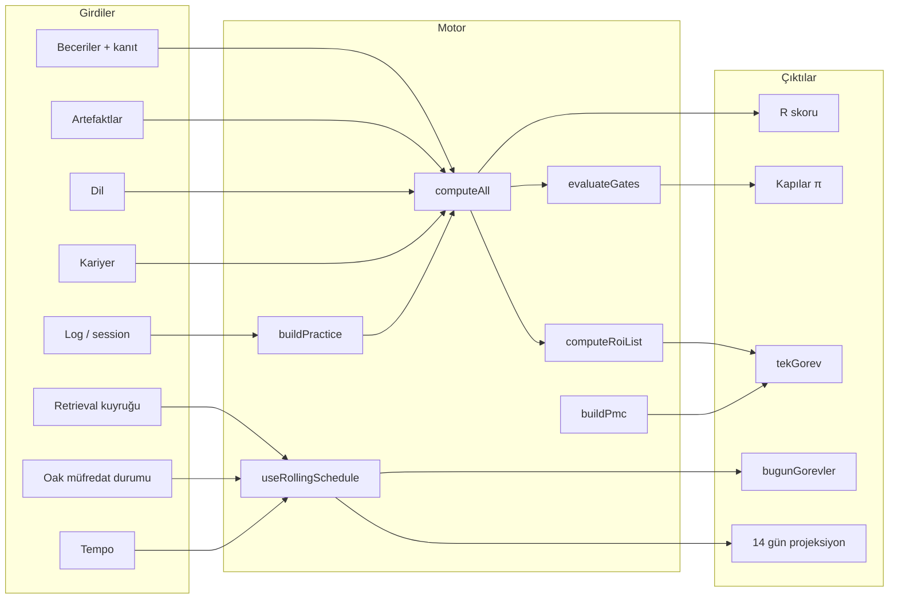

---

## 2. Mimari

### 2.1 Teknoloji yığını

| Katman | Teknoloji | Dosya |
|--------|-----------|-------|
| UI | React 19 + TypeScript | `src/pages/*.tsx` |
| Routing | react-router-dom | `src/App.tsx` |
| State | React Context + `useState` | `src/store.tsx` |
| Türetilmiş veri | `useMemo` hook | `src/useDerived.ts` |
| Plan motoru | `useMemo` hook | `src/useRollingSchedule.ts` |
| Müfredat durumu | Ayrı localStorage hook | `src/useCurriculumStatuses.ts` |
| Model | Saf fonksiyonlar | `src/model/compute.ts` |
| Sabitler | Tek `MODEL` objesi | `src/model/constants.ts` |
| Kalıcılık | `localStorage` JSON | `STORAGE_KEY`, `CURRICULUM_STORAGE_KEY` |

### 2.2 Katman diyagramı

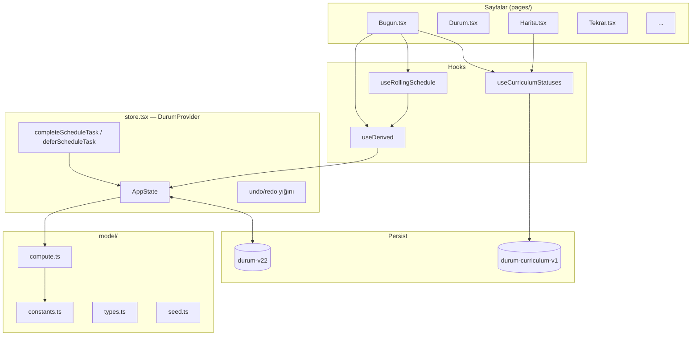

### 2.3 Veri akışı: kullanıcı eylemi → UI

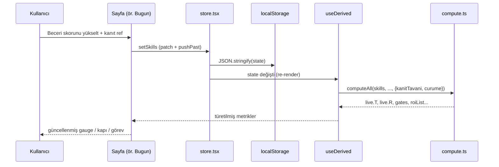

### 2.4 Undo / redo

- **Yığın:** `pastRef` / `futureRef`, en fazla 50 adım (`MAX_HISTORY`).
- **Birleştirme:** 800 ms içindeki ardışık düzenlemeler tek adım (`COALESCE_MS`).
- **Kısayol:** `Ctrl+Z` / `Ctrl+Y` (input içinde de çalışır).
- **Kalıcılık:** Undo sonrası `localStorage` microtask ile güncellenir.

### 2.5 localStorage anahtarları (özet)

| Anahtar | İçerik | Dosya |
|---------|--------|-------|
| `durum-v22` | Tam `AppState` | `constants.ts` → `STORAGE_KEY` |
| `durum-curriculum-v1` | Oak konu durumları | `oakCurriculum.ts` → `CURRICULUM_STORAGE_KEY` |

---

## 3. Veri modeli

### 3.1 AppState (`types.ts`)

```typescript
type AppState = {
  skills: Skill[];           // 12 alan
  artifacts: Artifact[];   // üretim kanıtları
  lang: LangState;         // DE + EN
  career: CareerItem[];    // 5 kariyer maddesi
  tempo: Tempo;            // haftalık saat + kalite
  retrieval: RetrievalItem[];  // FSRS kuyruğu
  history: LogRecord[];    // append-only log
  pending: string[];       // export bekleyen JSONL satırları
  chancenkarte: ChancenkarteState;
  draft: SessionDraft;     // Log sayfası taslağı
  scheduleCarry: ScheduleCarryItem[];      // taşınan görevler
  scheduleCompletedToday: Record<string, string[]>;  // ISO tarih → tamamlanan id'ler
};
```

### 3.2 Skill

| Alan | Tip | Açıklama |
|------|-----|----------|
| `id` | string | `net`, `linux`, `win`, … `port` |
| `name` | string | Görünen ad |
| `weight` | number | T ağırlığı (port hariç Σw = 10.9) |
| `claimed` | 0–10 | Beyan skoru |
| `evidence` | `yok` \| `kayit` \| `public` | Kanıt seviyesi |
| `ref` | string | Dosya yolu veya URL |

### 3.3 RetrievalItem (FSRS)

| Alan | Tip | Açıklama |
|------|-----|----------|
| `topic` | string | Konu metni |
| `alan` | string | Beceri alanı id |
| `difficulty` | kolay \| orta \| zor | Zorluk |
| `n` | number | Başarılı tekrar sayısı (çürüme τ için) |
| `stability` | number | S — kararlılık (gün) |
| `ef` | number | Easiness factor (SM-2 türevi) |
| `lastIso` | string | Son tekrar zamanı |

### 3.4 scheduleCarry ve scheduleCompletedToday

**scheduleCarry:** Kapasite yetmediğinde veya kullanıcı “Yarına aktar” dediğinde görev buraya yazılır. Ertesi gün `packDay` önceliğinde **ilk** işlenir.
- **Tavan (`MAX_CARRY = 2`):** Erteleme yığılması (*carry snowball*) riskine karşı taşınan görevler en fazla 2 adet ile sınırlandırılır.
- **Eskime (`MAX_CARRY_AGE_DAYS = 7`):** 7 günden eski taşınan görevler kullanıcı üzerinde psikolojik borç oluşturmaması için otomatik temizlenir ve müfredat havuzuna iade edilir.
- **Store fonksiyonları:** `deferScheduleTask`, `clearScheduleCarry` ve `recycleScheduleCarry` ("Havuza İade Et" butonu).

**scheduleCompletedToday:** ISO tarih (`YYYY-MM-DD`) → görev `id[]`. Bugün tamamlanan veya ertelenen görevler listeden gizlenir; simülasyon tekrar eklemez.

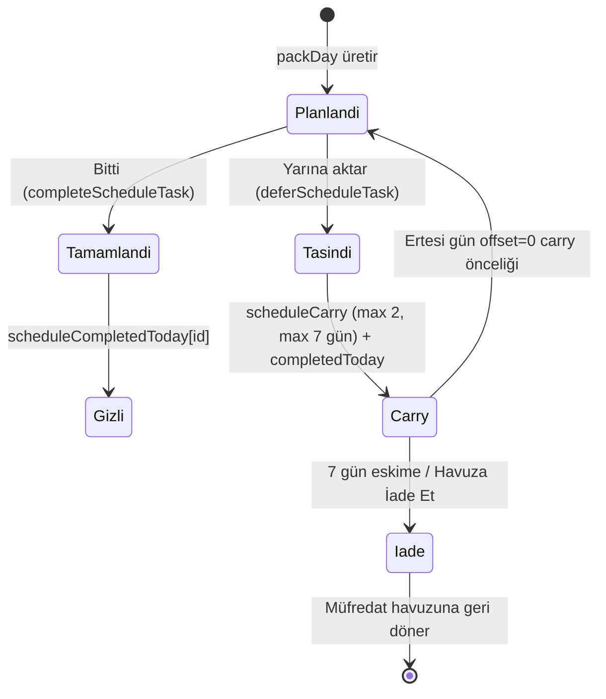

### 3.5 CurriculumStatus (Oak)

| Durum | Anlam |
|-------|-------|
| `ogrenilmedi` | Henüz başlanmadı |
| `ogreniyorum` | Aktif (varsayılan, covered konular) |
| `kuyrukta` | FSRS kuyruğunda (`retrieval` ile eşleşir) |
| `pekiştirildi` | Tamamlandı sayılır |
| `sonra` | EDR sonrası — kilitli (`upcoming: true`) |

Çözümleme: `resolveStatus()` in `useCurriculumStatuses.ts`.

---

## 4. Formüller

Tüm sabitler `MODEL` objesinden gelir (`src/model/constants.ts`). Aşağıdaki formüller **kodla birebir** uyumludur.

### 4.1 Kanıt tavanı (evidence ceiling)

```
oran(yok)   = 0.50  →  tavan = 5.0
oran(kayit) = 0.80  →  tavan = 8.0
oran(public)= 1.00  →  tavan = 10.0

x_tavanli = min(x_beyan, oran(kanıt) × x_max)
```

**Kod:** `evidenceCap(tier, max)` → `compute.ts`

### 4.2 Çürüme ve S_etkin

```
τ(n) = τ₀ × bⁿ     τ₀ = 10,  b = 2
çarpan(Δt, n) = taban + (1 − taban) × exp(−Δt / τ(n))     taban = 0.5

S_etkin = S_tavanli × çarpan(Δt, n)
```

- `Δt`: Son `session` veya `retrieval` üzerinden geçen gün (`buildPractice`).
- `n`: Başarılı retrieval sayısı; `basarisiz` → n − 2.

**Kod:** `decayMultiplier`, `buildPractice`, `computeAll`

### 4.3 T — Teknik bileşik

```
T = Σ (wᵢ × S_etkin,ᵢ) / Σ wᵢ        port HARİÇ (tHaric: ["port"])
Σw(T) = 10.9
```

#### Beceri ağırlıkları (kanonik)

| id | Alan | w | S* (hedef) |
|----|------|---:|---:|
| `def` | Defensive/SOC | 1.5 | 7 |
| `win` | Windows/AD | 1.4 | 6 |
| `port` | Portfolio | 1.4 | 7 (yalnız P/ROI) |
| `linux` | Linux | 1.3 | 6 |
| `net` | Networking | 1.2 | 6 |
| `siem` | SIEM | 1.1 | 7 |
| `secfund` | Security Fundamentals | 1.0 | 6 |
| `netsec` | Network Security | 0.9 | 5 |
| `py` | Python | 0.8 | 4 |
| `off` | Offensive | 0.7 | 3 |
| `crypto` | Crypto | 0.6 | 4 |
| `cloud` | Cloud | 0.4 | 3 |

**Kod:** `computeAll` döngüsü; `MODEL.tHaric`, `MODEL.hedef.S`

### 4.4 P — Üretim skoru

```
q_etkin = min(sahiplik, oran(kanıt))
katkı = q_etkin × v(tür)

P_sat(sum) = 10 × (1 − exp(−sum / κ))     κ = 5

P = max over tier t ∈ {public, kayit, yok}:
      min( P_sat(Σ_{kanıt ≥ t} katkı), oran(t) × 10 )
```

#### Artefakt değerleri (v)

| Tür | v | Tipik saat |
|-----|---:|---:|
| `soc-lab` | 3.0 | ~60 |
| `ad-lab` | 2.5 | ~40 |
| `vm-lab` | 2.0 | ~25 |
| `arac` | 1.5 | ~15 |
| `writeup` | 0.5 | ~6 |
| `lab-egzersizi` | 0.5 | ~8 |

**Kod:** `MODEL.artefaktDeger`, `MODEL.pKappa`, `computeAll` P dalı

### 4.5 L — Dil skoru

```
DE = 0.6 × konuşma + 0.4 × genel
EN = 0.6 × konuşma + 0.4 × genel
L  = 0.55 × DE_etkin + 0.45 × EN_etkin
```

CEFR çıpaları: A1=1.5, A2=3, B1=5, B2=7.5, C1=9.5

**Kod:** `langComposite`, `langScores`, `MODEL.L`

### 4.6 C — Kariyer skoru

```
C = Σ min(beyanᵢ, oran(kanıtᵢ) × maxᵢ)     Σ max = 10
```

| Madde | max |
|-------|---:|
| CV hazır | 2 |
| Ağ (LinkedIn + referans) | 2 |
| Staj belgelenmiş | 2 |
| Başvuru funnel aktif | 2 |
| Mülakat pratiği | 2 |

### 4.7 R — Readiness (geometrik, ρ=0)

```
T̂ = max(T/10, 0.02)
P̂ = max(P/10, 0.02)
L̂ = max(L/10, 0.02)
Ĉ = max(C/10, 0.02)

R = 100 × T̂^0.40 × P̂^0.25 × L̂^0.20 × Ĉ^0.15
```

**Hedef vektörü:** T*=5.8, P*=6.6, L*=7.5, C*=9.0 → **R_hedef ≈ 67.3**  
**Giriş vektörü:** T*=5.0, P*=5.0, L*=6.1, C*=7.0 → **R_giriş ≈ 54.8**

Üç R katmanı (`useDerived`):

| Gösterge | Hesap | Anlam |
|----------|-------|-------|
| `beyan.R` | kanitTavani=false, curume=false | Saf beyan |
| `kanitsizTavan.R` | kanitTavani=true, curume=false | Kanıt tavanı |
| `live.R` | kanitTavani=true, curume=true | **Etkin (kapılar bunu kullanır)** |

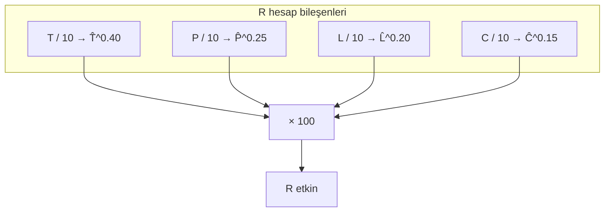

**Kod:** `computeRFromDims`, `rHedef`, `rGiris`

### 4.8 CTL / ATL / TSB

```
load_g = (h_siber × 0.80 + h_dil × 0.20) × kalite × 10

CTL_g = CTL_{g−1} + (load_g − CTL_{g−1}) / 42
ATL_g = ATL_{g−1} + (load_g − ATL_{g−1}) / 7
TSB   = CTL − ATL

v_tahmin(CTL) = (0.7 × CTL − 3.7) / 9.25
v_tahmin(plan) = (h_eff − 3.7) / 9.25     h_eff = (h_s×0.8 + h_d×0.2) × kalite
```

- `h₀ = 3.7`: bakım eşiği; altında v negatif.
- `kalite`: son 14 gün session ortalaması veya `tempo.quality`.

**Kod:** `buildPmc`, `predictedVelocity`, `predictedVelocityFromCtl`

### 4.9 FSRS — hatırlama olasılığı

```
R(t, S) = (1 + factor × t / S)^(−w20)

factor = 0.6935    (kod sabiti; ≈ ln 2)
w20    = 0.2
rHedef = 0.85

vadesi geldi ⇔ R(t, S) < 0.85
```

**Stabilite güncellemesi (SM-2 türevi):**

| Sonuç | EF | S | n |
|-------|----|---|---|
| `basarili` | min(ef+0.1, 2.8) | min(s×ef, 90) | n+1 |
| `zorlandim` | max(ef−0.14, 1.3) | s × max(1, ef−0.6) | — |
| `basarisiz` | max(ef−0.54, 1.3) | max(s×0.35, s₀) | max(n−2, 0) |

Başlangıç: `s₀=3`, `ef₀=2.5`

**Kod:** `retrievability`, `isRetrievalDue`, `nextStability`

### 4.10 Chancenkarte puan motoru

Ön koşul: mesleki eğitim ≥2 yıl ∧ (DE≥A1 ∨ EN≥B2) ∧ geçim kanıtı.

| Kriter | Puan |
|--------|---:|
| Kısmi denklik (Anerkennung) | 4 |
| Almanca B2+ | 3 |
| Almanca B1 | 2 |
| Almanca A2 | 1 |
| İngilizce C1 | 1 |
| Yaş ≤35 | 2 |
| Yaş ≤40 | 1 |
| Engpassberuf (beyan) | 1 |

**Eşik:** net ≥ 6 puan (`MODEL.chancenkarte.puanEsik`)

**Runway (Gate F):**

```
runway_ay = (birikim + aylikTasarruf × 12) / 1091
```

**Kod:** `computeChancenkarte`, `runwayAy`

### 4.11 ROI ve tekGorev

```
ROI = ΔR / saat
ROI_etkin = ROI × (1 + λ × [iş kapı darboğazında mı])     λ = 1.5
```

`ΔR` her aday için `computeAll` yeniden çalıştırılarak hesaplanır (analitik türev değil).

**tekGorev öncelik sırası** (`useDerived`):

1. Geri dönüş modu → hafif tekrar
2. TSB < −20 → dinlenme
3. Vadesi geçmiş tekrar ≥1
4. ROI listesinden günlük bütçe (≤0.75 sa)
5. Fallback: skorları güncelle

**Kod:** `computeRoiList`, `useDerived` → `tekGorev`

### 4.12 Bottleneck alan (claimed/weight)

Rolling schedule ve Harita “Bugün” filtresi için:

```
bottleneckAlan = argmin_{s ≠ port} (claimed_s / weight_s)
```

**Seed örneği:**

| Alan | claimed | w | claimed/w |
|------|--------:|---:|---:|
| def | 3 | 1.5 | **2.00** ← en düşük |
| win | 3 | 1.4 | 2.14 |
| siem | 3 | 1.1 | 2.73 |
| linux | 4 | 1.3 | 3.08 |
| net | 6 | 1.2 | 5.00 |

→ Zayıf alan: **Defensive/SOC** (`def`)

**Boyut darboğazı** (T/P/L/C):

```
darbogaz = argmin_k (v_k / hedef_k)
```

Seed: P=0.95/6.6 = **0.144** (Üretim en zayıf boyut)

**Kod:** `bottleneckAlan` in `useRollingSchedule.ts`; `useDerived` → `darbogaz`

### 4.13 Rolling schedule — kapasite, packDay ve A/B Günü Ritmi

**Günlük kapasite:**

```
dailyCyber = max(0.5, hoursCyber / 7)
kapasite   = clamp(dailyCyber, 0.75, 2.0)   saat

Geri dönüş veya TSB < −20 (bugün): kapasite = 0.25 sa
```

**28 sa/hf örneği:** `28/7 = 4` → `min(2, max(0.75, 4))` = **2 sa/gün**

**A/B Günü (Konu Günü vs Lab Günü) Ritmi:**
Günde 4 farklı parçayı (Tekrar + Temel + Zayıf Alan + Lab) aynı anda 120 dakikaya sıkıştırıp bilişsel bölünme (%107.5 doluluk) yaratmak yerine `getDayType(offset)` ile 2:1 ritmine geçilmiştir:

- **Gün A (Konu Günü — Derinleşme):**
  - FSRS Tekrarı (max 3) $\to$ ~24 dk
  - Temel Omurga Konusu (`FOUNDATION_ALANS`) $\to$ ~30 dk
  - Zayıf Alan Konusu (`bottleneckAlan`) $\to$ ~30 dk
  - *Toplam:* ~84-85 dk (odaklanmış teorik derinleşme)
- **Gün B (Lab Günü — Uygulama):**
  - FSRS Tekrarı (max 2) $\to$ ~16 dk
  - Kapsamlı SOC / AD Lab Pratiği $\to$ ~60-90 dk
  - *Toplam:* ~76-106 dk (kesintisiz pratik odak)

**Ritim döngüsü:** `offset % 3 === 2` ise **Gün B (Lab Günü)**, aksi halde **Gün A (Konu Günü)**.

**packDay öncelik akışı:**

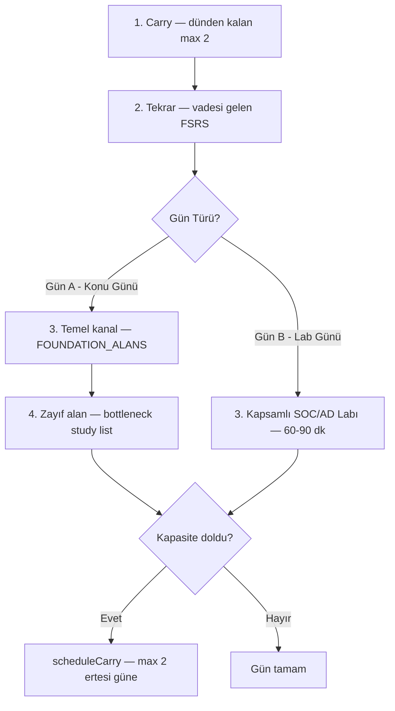

**Çift kanal (temel + zayıf):**

| Kanal | Alanlar | Sıralama | Amaç |
|-------|---------|----------|------|
| **Temel** | `net`, `linux`, `secfund` | `claimed/weight` artan + round-robin | SOC yolu omurgası |
| **Zayıf** | `bottleneckAlan` | Oak müfredat sırası, `studyCandidates` | Darboğaz kapatma |

**Görev süreleri ve sınırları:**

| Tür | Süre | Gün Limiti |
|-----|------|------------|
| tekrar | 8 dk (0.133 sa) | Gün A'da max 3, Gün B'de max 2 |
| konu / temel | 0.5 sa | Gün A'da 1 temel + 1 zayıf alan |
| lab | 1.0–1.5 sa (ROI/SOC) | Gün B'de 1 kapsamlı lab |
| carry (taşınan) | Görev süresine göre | Maksimum 2 görev, 7 gün ömür |

**Kod:** `packDay`, `useRollingSchedule`, `getDayType`, `FOUNDATION_ALANS`

### 4.14 Gate pipeline

```
π_G = ort( min(1, xᵢ / eşikᵢ) )
darboğaz = argminᵢ (xᵢ / eşikᵢ)
```

| Kapı | Koşul | Açılan |
|------|-------|--------|
| **0** | Denklik biliniyor | Chancenkarte / vize yolu |
| **A** | net≥6 ∧ linux≥6 ∧ win≥5 | Defensive lab yoğunluğu |
| **B** | A ∧ secfund≥6 ∧ siem≥5 | Mini SOC lab |
| **C** | ≥2 public+sahipli artefakt, ≥1 deger≥2.5 | CV proje satırı |
| **D** | R≥R_giriş ∧ C ∧ 0 ∧ DE≥5 ∧ EN≥7 | Almanya başvurusu |
| **E** | D ∧ son 14 günde mülakat ≥2 | Yoğun mülakat |
| **F** | Runway ≥12 ay | Chancenkarte süresi |

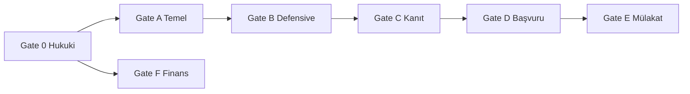

Tüm eşikler **`S_etkin`** (kanıt + çürüme) ile karşılaştırılır.

**Kod:** `evaluateGates`, `GatePipeline.tsx`

### 4.15 Sayısal örnekler

#### Örnek A — Seed R hesabı

```
T = 44.7 / 12.3 = 3.63
P = 0.95
L = 0.55×2 + 0.45×5 = 3.35   (EN tavanlı)
C = 2.00

R = 100 × 0.363^0.40 × 0.095^0.25 × 0.335^0.20 × 0.200^0.15
  ≈ 26.62
```

#### Örnek B — FSRS vade (seed r1, S=3)

```
R(11, 3) = (1 + 0.6935 × 11/3)^(−0.2) ≈ 0.851
R(12, 3) = (1 + 0.6935 × 12/3)^(−0.2) ≈ 0.847 < 0.85  → VADESİ GELDİ
```

#### Örnek C — v_tahmin (28 siber + 7 dil, kalite 0.85)

```
h_eff = (28×0.8 + 7×0.2) × 0.85 = 20.23
v = (20.23 − 3.7) / 9.25 ≈ 1.84 ΔR/hafta
```

---

## 5. Sayfa sayfa rehber

| Rota | Dosya | İşlev |
|------|-------|-------|
| `/` | `Bugun.tsx` | Günlük görev kartları, 14 gün timeline, journey strip, gauge'lar |
| `/durum` | `Durum.tsx` | R halkası, T/P/L/C, radar, kanıt açığı / çürüme |
| `/beceriler` | `Beceriler.tsx` | Beceri/artefakt/dil/kariyer düzenleme + mandal |
| `/kapilar` | `Kapilar.tsx` | Gate 0–F detay, π, darboğaz |
| `/almanya` | `Almanya.tsx` | Chancenkarte, Anerkennung, dual rota ETA, runway |
| `/hiz` | `Hiz.tsx` | CTL/ATL/TSB grafik, v, κ, ROI tablosu, projeksiyon |
| `/harita` | `Harita.tsx` | Oak müfredat graf/ağaç/liste, kuyruğa ekleme |
| `/tekrar` | `Tekrar.tsx` | FSRS kuyruk, sonuç işaretleme, toplu ekleme |
| `/log` | `Log.tsx` | Session, snapshot, JSONL import/export, seed sıfırla |
| `/formuller` | `Formuller.tsx` | MODEL sabitlerinden üretilen formül referansı |

---

## 6. Oak müfredat

### 6.1 Kaynak dosyalar

| Dosya | Konu sayısı | Anlam |
|-------|------------:|-------|
| `src/data/tekrar-ekle.txt` | **141** | Aktif Oak yolu (EDR aşamasına kadar) |
| `src/data/tekrar-sonra.txt` | **8** | EDR sonrası — SIEM/Splunk, SOC IR, Wazuh/Splunk Mini SOC Projesi (`upcoming: true`, kilitli/açılabilir) |

Kaynak: `Oak-Study-Notes/TEKRAR-EKLE.txt`, `TEKRAR-SONRA.txt`

### 6.2 EDR Sonrası Kilitli Konular ve Somut SOC Labları

`tekrar-sonra.txt` içerisindeki konular EDR aşaması bittikten sonra doğrudan açılmak üzere sektörel standartlara göre detaylandırılmıştır:

1. `SIEM Mimarisi ve Log Toplama (Syslog / WinEvent / Sysmon)`
2. `Splunk Temelleri ve SPL Sorgulama`
3. `SOC Alarm Triage ve Olay İnceleme (IR Workflow)`
4. `Nessus & Zaafiyet Taraması Temelleri`
5. `Project 2: Active Directory & Network Hardening`
6. `Project 3: Web & Network Sızma Testi Raporu`
7. `Project 4: Mini SOC & SIEM Lab (Wazuh / Splunk + Sysmon)`
8. `Temel GRC: ISO 27001, BSI IT-Grundschutz ve GDPR`

**Gate B & Gate C Lab Eylemleri (`compute.ts`):**
- *Sysmon + Wazuh / Splunk Lab Kurulumu ve Analizi* ($v=3.0$, Gate B ve C'yi açar)
- *Active Directory Saldırı & Savunma Labı* ($v=2.5$, Gate C için)

### 6.2 Parse formatı

```
alan|zorluk|konu metni
```

Örnek: `net|orta|DNS query/response (Wireshark)`

**Kod:** `parseLines()` → `oakCurriculum.ts`

### 6.3 Kenar üretimi (graf bağlantıları)

1. **PAIR_RULES:** Anahtar kelime çiftleri (dns↔dhcp, kerberos↔ldap, …)
2. **Alan içi token paylaşımı:** Aynı alanda ≥4 harfli ortak token → kenar (düğüm başına max 2)

**Kod:** `attachLinks()`, `curriculumEdges()`

### 6.4 Temel kanal alanları

```typescript
FOUNDATION_ALANS = ["net", "linux", "secfund"]
```

Günlük planda zayıf alandan **bağımsız** zemin oluşturur.

### 6.5 tekrar-ekle vs tekrar-sonra

| Özellik | tekrar-ekle (covered) | tekrar-sonra (upcoming) |
|---------|----------------------|-------------------------|
| FSRS'e otomatik girer | Hayır — Harita'dan seçilir | Hayır |
| Durum varsayılanı | `ogreniyorum` | `sonra` (kilitli) |
| Override | — | `allowSonraOverride` + `forceSonra` |
| Schedule'da | `studyCandidates` | Hariç (`pekiştirildi`/`ogrenilmedi`/`sonra`) |

---

## 7. Bugün sayfası akışı

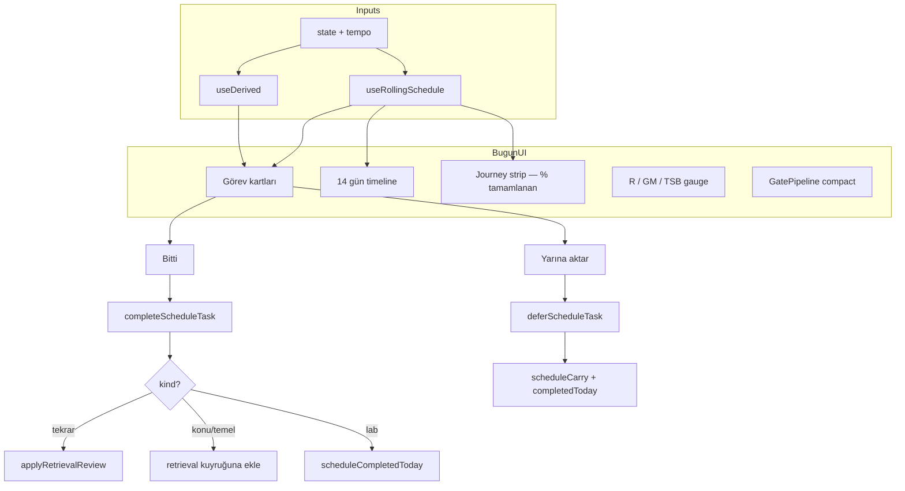

### 7.1 Görev kartı türleri ve Arayüz Bileşenleri

| Bileşen / kind | Etiket / Açıklama | Renk / Rozet |
|----------------|-------------------|--------------|
| `dayType` rozeti | Günün modu: `KONU GÜNÜ (Konu & Tekrar)` veya `LAB GÜNÜ (Lab & SOC)` | `.bugun-day-badge--A` / `--B` |
| `scheduleCarry` göstergesi | `N taşınan görev (tavan: 2)` + `[Havuza İade Et]` butonu | `.bugun-gorevler__clear-carry` |
| `tekrar` | Konu tekrarı (FSRS vadesi gelenler) | Alan rengi |
| `temel` | Temel konu çalışma (`FOUNDATION_ALANS`) | `TEMEL` rozeti (.gorev-card__badge--temel) |
| `konu` | Zayıf alanda sıradaki konu (Bottleneck) | `ZAYIF ALAN` rozeti (.gorev-card__badge--zayif) |
| `lab` | Kapsamlı Lab / SOC Pratiği (Gün B) | `LAB / PRATİK` rozeti |
| `dinlenme` | Dinlenme / Hafif gün | TSB düşükken |

### 7.2 scheduleCompletedToday ve Carry Davranışı

- **Bitti:** Görev id'si bugünün listesine eklenir; UI'dan gizlenir. İlgili yan etki çalışır (FSRS kaydı güncellenir veya konu kuyruğa eklenir).
- **Yarına aktar:** Aynı id bugünün listesine eklenir (bugün gizlenir) **ve** `scheduleCarry` listesine eklenir (tavan: 2).
- **Havuza İade Et (`recycleScheduleCarry`):** Taşınan görevleri tek tıkla silip müfredat havuzuna geri döndürür.
- **7 Günlük Eskime:** 7 günü geçen taşınan görevler hafızadan otomatik düşürülür.

### 7.3 14 gün projeksiyon

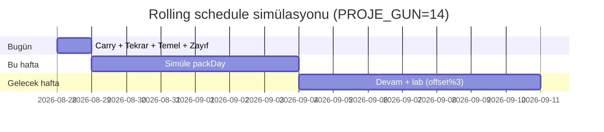

Simülasyon state'i (`SimState`) her gün güncellenir; taşınan görevler `tasima` sayacına yansır.

---

## 8. Harita (grafik düzeni)

### 8.1 Görünüm modları

| Mod | Açıklama |
|-----|----------|
| `harita` | Force-directed graf (varsayılan) |
| `agac` | Alan bazlı ağaç |
| `liste` | Filtrelenebilir tablo |

### 8.2 Layout pipeline

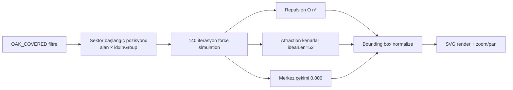

**Sabitler:** `repulsion=920`, `attraction=0.012`, `idealLen=52`, `damp=0.82`, `iterations=140`

**Kod:** `forceDirectedLayout()` — `Harita.tsx` ~satır 601

### 8.3 Zoom ve etiketler

| Parametre | Değer |
|-----------|------|
| MIN_ZOOM | 0.35 |
| MAX_ZOOM | 3.5 |
| ZOOM_STEP | 1.15 |
| LABEL_ZOOM_THRESHOLD (141 düğüm) | 1.5 |
| LABEL_ZOOM_THRESHOLD_SMALL (≤16 düğüm) | 1.2 |

Etiket görünürlüğü: seçili veya hover → her zaman; aksi halde zoom eşiği.

**Kod:** `nodeLabelVisible`, `truncateNodeLabel`, `CurriculumGraph` bileşeni

### 8.4 Etkileşim

- Düğüm tıkla → detay paneli, durum değiştir, kuyruğa ekle/çıkar
- “Bugün” filtresi → bottleneck + `ogreniyorum` konuları
- Yaklaşan konular → kilit; `forceSonra` ile override

---

## 9. FSRS tekrar kuyruğu

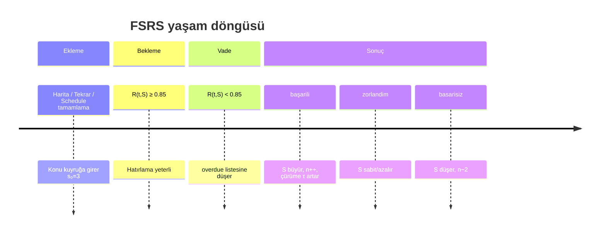

### 9.1 Kuyruk önceliği

```
overdueRatio = (rHedef − R(t,S)) / rHedef     (R < rHedef iken)
Sıralama: overdueRatio azalan
Bugün limiti: MODEL.tekrar.kuyrukTavani = 3
```

**Kod:** `useDerived` → `overdue`, `kuyruk`; `Tekrar.tsx`

### 9.2 Schedule ile entegrasyon

`completeScheduleTask`:
- `tekrar-batch-*` → tüm overdue öğeleri `basarili` işler
- Tekil `tekrar-*` → ilgili `retrievalId`
- `konu` / `temel` → konu yoksa `retrieval`'a yeni `RetrievalItem` ekler

---

## 10. localStorage şeması ve migration

### 10.1 durum-v22 (AppState)

```json
{
  "skills": [ /* 12 Skill */ ],
  "artifacts": [ /* Artifact[] */ ],
  "lang": { "deKonusma": 1, "deGenel": 1.5, "enKonusma": 4, ... },
  "career": [ /* 5 CareerItem */ ],
  "tempo": { "hoursCyber": 28, "hoursLang": 7, "hoursLangAlt": 14, "quality": 0.85 },
  "retrieval": [ /* RetrievalItem[] */ ],
  "history": [ /* LogRecord[] */ ],
  "pending": [],
  "chancenkarte": { "yas": 30, "gate0": "bilinmiyor", ... },
  "draft": { "alan": "net", "dakika": "60", ... },
  "scheduleCarry": [],
  "scheduleCompletedToday": { "2026-08-28": ["konu-oak-net-001-dns-..."] }
}
```

**Yükleme:** `loadState()` — eksik alanlar seed ile merge:

```typescript
{ ...createSeedState(), ...parsed, scheduleCarry: parsed.scheduleCarry ?? [], scheduleCompletedToday: parsed.scheduleCompletedToday ?? {} }
```

### 10.2 durum-curriculum-v1

```json
{
  "statuses": {
    "oak-net-001-dns-query-response-wireshark": "pekiştirildi",
    "oak-linux-012-chmod-sticky-bit": "ogreniyorum"
  }
}
```

### 10.3 Migration notları

| Sürüm | Anahtar | Değişiklik |
|-------|---------|------------|
| v22 | `durum-v22` | `scheduleCarry`, `scheduleCompletedToday` eklendi |
| v1 | `durum-curriculum-v1` | Oak durumları ana state'ten ayrıldı |

Eski anahtarlar otomatik migrate **edilmez**; manuel import veya seed sıfırlama gerekir.

---

## 11. Seed verisi (EDR aşaması profili)

**Tarih:** `2026-08-27T12:00:00+03:00` (`SEED_ISO`)  
**Profil:** Oak EDR öncesi · Almanya junior SOC hazırlığı başlangıcı

### 11.1 Beceri snapshot

| Alan | Beyan | Kanıt | S_etkin (Δt=0) |
|------|------:|-------|---------------:|
| net | 6 | yok | 5.0 |
| linux | 4 | yok | 4.0 |
| win | 3 | yok | 3.0 |
| secfund | 7 | yok | 5.0 |
| siem | 3 | yok | 3.0 |
| def | 3 | yok | 3.0 |
| … | … | … | … |

### 11.2 Türetilmiş skorlar

| | Beyan | Kanıt tavanlı | Etkin |
|---|------:|---:|---:|
| T | 4.14 | 3.63 | **3.63** |
| P | 1.81 | 0.95 | **0.95** |
| L | 3.80 | 3.35 | **3.35** |
| C | 2.00 | 2.00 | **2.00** |
| **R** | 31.68 | 26.62 | **26.62** |

**Kanıt açığı:** 31.68 − 26.62 = **5.06 R**

### 11.3 Kapı durumu (seed)

| Kapı | π | Darboğaz |
|------|--:|----------|
| A | %66 | Windows/AD 3/5 |
| B | %70 | SIEM 3/5 |
| C | %0 | Public artefakt 0/2 |
| D | %41 | Gate C |

### 11.4 Seed retrieval (8 konu)

DNS, TCP handshake, Linux permissions, CIA triad, kripto, Windows event log, Python socket, SOC triage — `SEED_RETRIEVAL` in `seed.ts`

### 11.5 Journey konumu

EDR konusu tamamlanmamışsa konum metni bottleneck + sıradaki konuyu gösterir. EDR bitince: `EDR sonrası · sıradaki: {OAK_UPCOMING[0]}`

---

## 12. Bilinen sınırlamalar, denetim bulguları ve gelecek işler

### 12.1 Tamamlanan İyileştirmeler (Denetim Raporu Sonrası)

[`SISTEM-DENETIM-VE-TEST-RAPORU.md`](./SISTEM-DENETIM-VE-TEST-RAPORU.md) doğrultusunda uygulanan çözümler:

| Sorun / Risk | Çözüm | Durum |
|--------------|-------|:-----:|
| **Erteleme Yığılması (Carry Snowball)** | `MAX_CARRY = 2` tavanı ve `MAX_CARRY_AGE_DAYS = 7` eskime mekanizması getirildi; "Havuza İade Et" butonu eklendi. | 🟢 Çözüldü |
| **Bilişsel Bölünme (%107.5 doluluk)** | A/B Günü ritmi (`getDayType`: 2 Gün Konu, 1 Gün Lab) kurularak günlük yük dengelendi. | 🟢 Çözüldü |
| **SIEM / Splunk Modül Eksikliği** | `tekrar-sonra.txt` konuları somutlaştırıldı; Sysmon/Wazuh ve AD Lab eylemleri tanımlandı. | 🟢 Çözüldü |
| **Bitti / Yarına Aktar Buton Tepkisizliği** | `scheduleCompletedToday` ve yan etkiler (FSRS / kuyruk ekleme) bağlanarak toast bildirimi eklendi. | 🟢 Çözüldü |
| **Harita Etkileşimsizliği** | Pan/zoom, sürükleme ve zoom seviyesine göre kademeli etiket görünümü (`LABEL_ZOOM_THRESHOLD`) eklendi. | 🟢 Çözüldü |

### 12.2 Doğrulanmış sınırlamalar

| Konu | Açıklama |
|------|----------|
| **README R tutarsızlığı** | README “R≈23” der; seed hesabı **26.62** (`SEED_HISTORY`) |
| **FSRS factor** | Model belgesi `19/81`; kod `0.6935` kullanır |
| **Bottleneck** | Schedule `claimed/weight` kullanır; kapılar `S_etkin` — kasıtlı ayrım |
| **Harita performans** | 141 düğümde ~200 ms layout (SITE-DENETIMI) |
| **Ayrı curriculum store** | Müfredat durumu ana undo yığınına dahil değil |
| **Backend yok** | Tamamen istemci-yanlı; çoklu cihaz senkronu yok |

### 12.3 Olası gelecek işler

- [ ] `scheduleCompletedToday` için gece yarısı otomatik temizlik
- [ ] Curriculum durumunu ana store + undo'ya taşıma
- [ ] FSRS factor belge/kod hizalaması
- [ ] Ölçülmüş hız için otomatik haftalık snapshot hatırlatıcısı
- [ ] Akrasia hedef gevşetme (`MODEL.akrasia.gevsetmeGun`) UI bağlantısı

---

## Ek: Dosya referans haritası

| Kavram | Birincil dosya | Fonksiyon / export |
|--------|----------------|-------------------|
| MODEL sabitleri | `model/constants.ts` | `MODEL`, `STORAGE_KEY` |
| Hesap motoru | `model/compute.ts` | `computeAll`, `evaluateGates`, `computeRoiList` |
| Seed | `model/seed.ts` | `createSeedState` |
| Store | `store.tsx` | `DurumProvider`, `useDurum`, `completeScheduleTask` |
| Türetilmiş | `useDerived.ts` | `useDerived` |
| Plan | `useRollingSchedule.ts` | `useRollingSchedule`, `packDay` |
| Müfredat | `data/oakCurriculum.ts` | `OAK_CURRICULUM`, `FOUNDATION_ALANS` |
| Müfredat durum | `useCurriculumStatuses.ts` | `useCurriculumStatuses`, `resolveStatus` |

---

*Bu belge durum-web kod tabanından türetilmiştir. Formül veya sabit değişikliğinde önce `MODEL` bloğu, sonra bu belge güncellenmelidir.*
